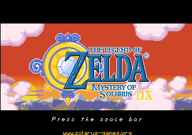

# Solarus — MiSTer FPGA (software rendering, direct framebuffer)



*The Legend of Zelda: Mystery of Solarus DX, captured live from the MiSTer FPGA
video output (320×240) — pure software rendering, no OpenGL.*

Port of the **Solarus** 2D action-RPG engine (the Zelda-like engine behind
*Mystery of Solarus DX*, *Ocean's Heart*, *Yarntown*, etc.) to **MiSTer FPGA**.
The engine runs on the DE10-Nano's ARM (Cortex-A9), renders entirely in
software, and writes frames **directly to the MiSTer DDR framebuffer**
(`0x3A000000`) — the same sink used by the gmloader blitter, but with **no
OpenGL / no Mesa** anywhere in the path. Audio and controller input are also
routed through the FPGA's shared DDR3 region, so the engine needs neither a GPU,
a display server, nor ALSA/evdev on the device.

## Why Solarus

Best "build-once, unlock-many" engine on the PortMaster no-GL shortlist: one
engine build unlocks **13 free PortMaster quests**, all fan-made 2D Zelda-likes
at ~320×240 — ideally sized for the A9. Unlike GameMaker/gmloader, Solarus has a
**first-class software renderer**, so it sidesteps the render-performance wall
that path is stuck behind.

## Features

- **Pure software rendering, zero GL.** Built with `-force-software-rendering`;
  OpenGL/GLEW are compiled out (no `libGL`/Mesa runtime dependency at all). The
  game composites into a CPU `SDL_Surface`.
- **Direct DDR framebuffer output.** A patch on `SDLRenderer::present()` reads the
  composited frame, converts to **RGB565**, and writes it to MiSTer DDR via
  `NativeVideoWriter` — native **320×240**, the MiSTer scaler handles display
  sizing. (Verified on hardware: `devmem 0x3A000000` updates per frame.)
- **DDR audio.** OpenAL output is captured via a loopback device and pushed to
  the FPGA's 48 kHz DDR3 audio ring (the OpenBOR audio path), replacing ALSA.
- **Controller input bridge.** The FPGA writes the P1 joystick bitmask to DDR;
  the engine edge-detects it each frame and synthesizes SDL key events mapped to
  Solarus's default bindings — playable with no per-quest config, no evdev.
- **Branded FPGA core.** A `Solarus_*.rbf` (CORENAME=Solarus), forked from the
  MiSTer OpenBOR core, provides the 320×240 framebuffer + controller-to-DDR
  passthrough. Built in CI (no local Quartus host needed).
- **Lean armhf runtime.** Custom-built SDL2 (dummy video + offscreen + ALSA, no
  X11/Wayland/GBM/DRM), LuaJIT 2.1, and a trimmed shared-library closure — all
  glibc-compatible with MiSTer's Buildroot (≤2.31).
- **Reproducible, host-agnostic build.** Everything cross-compiles in a Docker
  image on any x86_64/arm64 host (incl. Apple Silicon); the RBF builds in GitHub
  Actions. No binaries or quest data are committed — scripts rebuild/refetch.

## How a Solarus game runs

`solarus-run path/to/quest` — the engine is a shared runtime; each game is a
`.solarus` package (a zip of the quest's data + Lua scripts) **or** an unpacked
quest directory containing a `data/` tree. Quest data is supplied separately
(most are free downloads). First target: **The Legend of Zelda: Mystery of
Solarus DX** (free official game by the Solarus team).

## Repository layout

| Path | What it is |
|------|------------|
| `scripts/build_engine.sh` | Cross-build `solarus-run` + `libsolarus` for armhf (software-only) |
| `scripts/build_sdl2.sh` | Cross-build the lean SDL2 (no X11/Wayland/GBM) |
| `scripts/build_luajit.sh` | Cross-build LuaJIT 2.1 for armhf |
| `scripts/collect_runtime_libs.sh` | Gather the shippable `.so` closure → `deploy/libs/` |
| `scripts/fetch_quest.sh` | Download the Mystery of Solarus DX quest |
| `scripts/package_quest.sh` | Package a quest dir → single-file `<name>.sol` |
| `scripts/Solarus.sh` | MiSTer **Scripts**-menu launcher (loads core + runs engine) |
| `games/Solarus/_handler.sh` | Auto-launch dispatcher (Master_Daemon fires it on core load) |
| `games/Solarus/solarus_run.sh` | Shared launch logic (env + quest resolve + exec) |
| `patches/mister/` | DDR video/audio writers + the SDL renderer present-hook glue |
| `fpga/` | Quartus project for the branded `Solarus` RBF |
| `.github/workflows/build-rbf.yml` | CI build of the RBF (raetro/quartus:17.0) |
| `deploy.py` | Push the assembled tree to a running MiSTer over SSH (key auth) |
| `deploy/` | Assembled deploy tree (`solarus-run`, `libs/`, `quests/`) — gitignored |

## Usage

### 1. Build the engine + runtime (host, in Docker)

```bash
# One-time: build the cross toolchain image
docker build -f Dockerfile.solarus-build -t solarus-armhf-build:bullseye .

# One-time: register the armhf qemu binfmt handler (needed by the LuaJIT build)
docker run --rm --privileged tonistiigi/binfmt --install arm

RUN="docker run --rm -v $(pwd):/src -w /src solarus-armhf-build:bullseye"
$RUN scripts/build_sdl2.sh          # lean SDL2
$RUN scripts/build_luajit.sh        # LuaJIT 2.1
$RUN scripts/build_engine.sh        # solarus-run + libsolarus  → build/armhf/
$RUN scripts/collect_runtime_libs.sh # shippable .so set         → deploy/libs/
```

The present-hook is applied automatically by `build_engine.sh` (it copies
`patches/mister/*` into the Solarus source and builds with
`-DMISTER_NATIVE_VIDEO -DMISTER_NATIVE_AUDIO`).

### 2. Build the FPGA core

Push to GitHub and let **Actions** build it (`.github/workflows/build-rbf.yml`),
or build locally with Quartus Prime Lite 17.0+:

```bash
cd fpga && ./build_solarus.sh        # → ../_Other/Solarus_YYYYMMDD.rbf
```

### 3. Fetch + package a quest

```bash
scripts/fetch_quest.sh               # → deploy/quests/mystery_of_solarus_dx/ (a dir)
scripts/package_quest.sh deploy/quests/mystery_of_solarus_dx
                                     # → deploy/quests/mystery_of_solarus_dx.sol
```

A `.sol` is a Solarus `data.solarus` archive (a zip of the quest's `data/`
contents). The MiSTer OSD file browser filters on the 3-char `SOL` extension.

### 4. Deploy to MiSTer

`deploy.py` pushes the tree to the device over SSH (key-authed — no password). It
stops the running engine, uploads the binary/libs/handler/scripts/RBF, and fixes
exec bits:

```bash
./deploy.py                          # everything (default IP 192.168.20.81)
./deploy.py --no-rbf                 # skip the RBF
./deploy.py --host 1.2.3.4           # override device IP
```

Resulting on-device tree (mirrors the repo SD-mirror layout):

```
/media/fat/games/Solarus/
  solarus-run
  libs/          # SDL2, SDL2_image/ttf, LuaJIT, OpenAL, vorbis, modplug, physfs, …
  _handler.sh    # Master_Daemon auto-launch dispatcher
  solarus_run.sh # shared launch logic
  quests/        # your <name>.sol quests
/media/fat/Scripts/Solarus.sh
/media/fat/_Other/Solarus_*.rbf
```

### 5. Run

Load the **Solarus** core from the MiSTer console menu. MiSTer's Master_Daemon
routes the loaded core by CORENAME → runs `games/Solarus/_handler.sh`, which
auto-launches the engine. Pick a quest from the MiSTer OSD (**Load Quest**) — the
selection is written to `/media/fat/config/Solarus.s0`, which the handler reads
and runs (it falls back to the first quest in `quests/` if nothing is picked).

Alternatively, run **Solarus** from the MiSTer **Scripts** menu (manual fallback:
loads the core, then runs the same shared launch logic). Logs go to
`/media/fat/logs/Solarus/Solarus.log`.

## How the no-GL path works (the gating risk, retired)

From Solarus 1.6 source (`src/graphics/Video.cpp`, `.../sdlrenderer/SDLRenderer.cpp`):

- **`-force-software-rendering`** → window without `SDL_WINDOW_OPENGL`; shaders
  off; the renderer chain skips `GlRenderer`.
- `SDLRenderer` uses **`SDL_RENDERER_SOFTWARE`** with `SDL_HINT_RENDER_DRIVER=software`.
- The windowless path renders into a CPU **`SDL_Surface`** via
  **`SDL_CreateSoftwareRenderer`** — the whole game composites into a
  system-memory buffer we control.
- **`SDL_RenderPresent`** is the single hook point where we grab the frame and
  DMA it to DDR.

Not installing `libgl-dev` makes `find_package(OpenGL)` empty, so the GL renderer
is compiled out and there's no `libGL` `DT_NEEDED` to ship.

## Status

**~90% complete — playable on hardware.** Engine cross-build, lean SDL2, LuaJIT,
headless boot, DDR video present-hook, on-hardware quest bring-up, controller
input, DDR audio, core packaging, and the branded FPGA core are all done and
verified on a real MiSTer. Title-screen perf is ~68–80 fps. The remaining work
is **deploy packaging** ([#7](https://github.com/gmcnaught/solarus-mister/issues/7)) —
polishing the one-step deploy/runtime bundle. Tracked under epic
[#1](https://github.com/gmcnaught/solarus-mister/issues/1).

## Licensing

Engine is **GPLv3**; the FPGA core inherits **GPL-3.0** from the MiSTer OpenBOR
core it forks. Quests are individually licensed (Mystery of Solarus DX is free,
by the Solarus team). Engine binaries and quest data are kept out of git — the
`scripts/` rebuild and refetch them.
