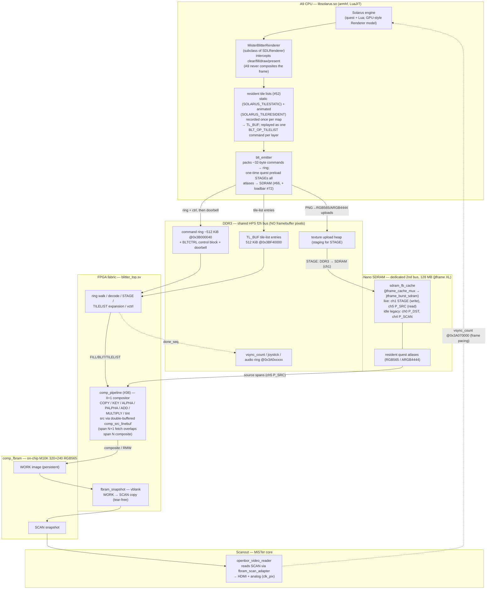

# Frame data flow (FPGA compositor, BRAM framebuffer, SDRAM-resident assets)

How a frame is generated end-to-end, reflecting the **current** architecture:
the A9 emits blit commands (mostly whole-layer **tile lists**), the FPGA fabric
composites the frame into an **on-chip (M10K BRAM) framebuffer**, source
pixels come from **quest atlases resident in SDRAM**, and the scanout reader
streams the framebuffer's vblank snapshot to video. The A9 never composites;
no framebuffer pixels cross the HPS-shared f2h bus, and none live in SDRAM.

> **Render path selection (engine):** `games/Solarus/solarus_run.sh` exports
> `SOLARUS_BLITTER=1` + `SOLARUS_BLITTER_SINGLEBUF=1` by default — the fabric
> compositor is the path, with a single persistent engine-side target (the
> fabric's vblank snapshot provides the tear-free double-buffer). `SOLARUS_SW=1`
> still selects the legacy software path (plain `SDLRenderer` →
> `NativeVideoWriter` full-frame DMA to DDR), but **current cores no longer scan
> out from DDR**, so it produces no video — engine-side debugging only.
>
> **Issue map (major stages):** #19 = SDRAM second-bus source path; #34 = VRAM
> relocation off the f2h bus + dedicated scanout; #36 = the pipelined compositor
> (`comp_pipeline`); PR #49 = FB-in-BRAM + snapshot double-buffer; #52 =
> `BLT_OP_TILELIST` fabric tile lists; #66 = whole-quest SDRAM asset residency;
> #72 = the load-progress bar during preload.

## The big picture

Three memories, three jobs:

| Memory | What lives there | Who touches it |
|---|---|---|
| **DDR3 (HPS-shared, f2h)** @`0x3A000000`/`0x3B000000` | command ring (~512 KiB @`0x3B000040`), BLTCTRL control block, texture upload heap (~15.2 MiB @`0x3B080000`), tile-list buffer `TL_BUF` (512 KiB @`0x3BF40000`), vsync counter, joystick, audio ring | A9 writes; fabric reads (and writes status) |
| **SDRAM (dedicated 2nd bus, 128 MB module)** | quest sprite/tile atlases, staged once at quest load (permanent residency, #66) | fabric only — STAGE writes, compositor source reads |
| **BRAM (on-chip M10K)** | the 320×240 RGB565 framebuffer (`comp_fbram`): compositor WORK image + its vblank SCAN snapshot | fabric writes/RMWs; scanout reads |

## Component + dataflow view



## Per-frame sequence

```mermaid
sequenceDiagram
    autonumber
    participant ENG as Solarus engine
    participant R as MisterBlitterRenderer
    participant EM as blt_emitter
    participant DDR as DDR3 (ring/ctrl/TL_BUF)
    participant FAB as blitter_top + comp_pipeline
    participant SD as SDRAM (resident atlases)
    participant FB as comp_fbram (BRAM WORK)
    participant OUT as Scanout (SCAN snapshot)

    Note over EM,SD: quest load (once): preload all atlases DDR3→SDRAM (STAGE, #66)<br/>with the on-screen load bar (#72); stage_barrier keeps P_SRC coherent
    ENG->>R: clear(target) → begin frame
    R->>EM: per-layer BLT_OP_TILELIST (static + animated lists, #52)
    loop remaining sprites/fills (tens)
        R->>EM: emit ~32B blit command (no A9 pixel work)
    end
    ENG->>R: present(window)
    EM->>DDR: copy ring + control block
    EM->>DDR: store submit_seq (doorbell, last)
    FAB->>DDR: fetch + decode commands (TILELIST expands from TL_BUF)
    loop each blit / expanded tile
        FAB->>SD: read source span (P_SRC; linebuf N+1 overlaps composite N)
        FAB->>FB: composite / RMW into WORK (II=1)
    end
    FAB->>DDR: store done_seq
    Note over FAB,OUT: at vblank: fbram_snapshot copies WORK → SCAN (tear-free)
    OUT->>ENG: vsync_count @0x3A070000 paces the next frame (SOLARUS_FASTPACE trims the wait)
```

## What replaced what

The original MiSTer path was **pure software**: the A9 composited the whole
frame into a CPU `SDL_Surface` and `present()` DMA'd it to a DDR3 framebuffer
the scanout read back over the contended f2h bus. Each stage of that pixel path
has been replaced, in order:

- **#19 + #34 (SDRAM VRAM era):** sources, then framebuffers + scanout, moved to
  the dedicated SDRAM bus — no frame pixels on f2h. The SDRAM controller was
  later pivoted to jtframe's cache subsystem (`sdram_fb_cache` =
  `jtframe_cache_mux` over `jtframe_burst_sdram`).
- **#36:** the legacy ~7–10 cyc/px per-pixel blitter FSM was superseded by
  `comp_pipeline`, a band-chunked RMW compositor issuing one pixel/clock through
  a blend pipeline (COPY / colorkey / const-alpha / per-pixel-alpha / ADD /
  MULTIPLY / tint — nothing escapes to software any more).
- **PR #49 (FB-in-BRAM):** the compositor destination and scanout source moved
  **on-chip** (`comp_fbram`). The SDRAM band preload / write-back that was
  44–66% of compositor cycles is gone (FILL ~1.05 cyc/px, COPY ~1.65 sim floor);
  `fbram_snapshot` copies WORK→SCAN at vblank so scanout is tear-free with a
  single persistent engine target (`SOLARUS_BLITTER_SINGLEBUF=1`). The cache's
  P_DST/P_SCAN channels are wired but idle; **ch1 STAGE + ch5 P_SRC remain the
  live SDRAM clients**.
- **#52 (tile lists):** per-tile draw calls (thousands per frame on 8×8-tile
  maps) collapsed into per-layer `BLT_OP_TILELIST` commands replayed by the
  fabric from `TL_BUF` — first the animated set (`SOLARUS_TILERESIDENT`), then
  the static set directly from the atlas (`SOLARUS_TILESTATIC`), retiring the
  CPU-side intermediate tile staging. This killed the A9 emit bottleneck.
- **#66 (asset residency):** instead of lazy per-surface staging, the whole
  quest's atlases are pre-staged into permanent SDRAM at load (with the #72
  progress bar), using jtframe XL addressing (`SDRAM_AW=25`, **128 MB module
  required**). Sources never re-upload mid-game.
- **Per-layer ARGB4444 plane bake (2026-07-09 design):** `SOLARUS_BGPLANE`'s
  baked-plane optimization — a per-layer alternative to #52's static
  `BLT_OP_TILELIST` replay that bakes a layer's static tiles ONCE per
  map/tileset change into a permanent SDRAM plane, replayed by one windowed
  COPY per frame instead of every static tile every frame — gained real
  per-pixel transparency: a small on-chip coverage tracker
  (`bgplane_coverage.sv`) mirrors every pixel the compositor actually writes
  during a bake, and `OP_BGPLANE_WRITE`'s writeback packs the plane as
  ARGB4444 (alpha=0xF covered / 0x0 uncovered) instead of an opaque RGB565
  fill; the read-back COPY became a `BLT_BLEND_PALPHA` blit, reusing the
  fabric's existing per-pixel-alpha blend path unchanged. That let the bake
  generalize from one hardcoded base-layer plane to one plane per layer with
  static content, and removed the `scroll_ratio != 1` (parallax)
  disqualification that previously forced a whole map's bake off whenever a
  parallax pattern shared the base layer with static ground tiles (Mystery of
  Solarus DX map 119 **pre-fix baseline**: `fabric_hw` ~52.8ms disqualified —
  over 3x the 16.7ms/60fps budget — vs. map 4's ~9.2ms fully-baked case; both
  from the design spec, before this work). HW-validated: map 119's parallax
  now composites correctly (behind the ground, not in front) with the bake
  engaged (Task 5), and the per-layer generalization (Task 6) renders
  correctly with graceful per-layer fallback to the ordinary per-bucket
  replay when a layer's SDRAM allocation fails — map 4/119 were not
  separately re-measured post-generalization, but Task 6 is reviewer-approved
  and HW-confirmed correct on both an interior and an overworld map:
  - **Interior map** (376×248): its one layer baked cleanly, no allocation
    failure — `fabric_hw` ~6.1ms, ~51fps.
  - **Overworld map** (1152×1040, 3 layers with static content): only layer 2
    baked; layers 0/1 hit the perm-SDRAM limit below and fell back — no
    crash, render correct, HUD intact — `fabric_hw` ~10ms, ~28fps (A9-bound,
    not fabric-bound).
  - HUD overlay unaffected by the bake in both cases (regression guard: the
    NEON-off SDL2 fix from `build: wire lean SDL2 into engine build` holds).

  **Current known limit:** permanent SDRAM is shared with the whole-quest
  atlas preload (#66); on the overworld above (~60 MiB atlas, ~4 MiB perm
  headroom) only 1 of 3 layer-planes fits, so the other 2 fall back to
  per-bucket replay — correct, but not accelerated. This is the natural,
  HW-confirmed case of a layer's `blt_alloc` failing gracefully: that layer
  alone falls back, every other layer's plane is unaffected, no corruption.
  Widening the perm-SDRAM budget for large-map per-layer bakes is a tracked
  follow-up, not yet done.
  See `docs/superpowers/specs/2026-07-09-parallax-layer-compositor-design.md`.

## Scanout read path

The scanout reader (`fpga/rtl/openbor_video_reader.sv`) is position-addressed
(pixel out anchored to `vcount`/`hcol`), so a stall degrades to a stale line,
never a cumulative drift. Since FB-in-BRAM its line fetches are served by
`fbram_scan_adapter`, which bridges the reader's cache-ok request protocol to
`comp_fbram`'s scan port — same-cycle BRAM reads, no SDRAM or DDR3 traffic on
the display deadline at all. Orthogonal paths (control word, VSYNC writeback,
joystick, audio) still ride DDR3.

## Datapath module map (as wired in `fpga/Solarus.sv`)

| Boundary | Bus | Notes |
|---|---|---|
| A9 → fabric | DDR3 ring @`0x3B000040` (~512 KiB) + doorbell | `blt_emitter` ~32 B FILL/BLIT/STAGE/TILELIST/END commands |
| A9 → fabric | DDR3 `TL_BUF` @`0x3BF40000` (512 KiB) | per-layer tile-list entries, recorded once per map |
| `blitter_top` → `comp_pipeline` | command regs + `blit_start`/`blit_done` | one blit at a time; TILELIST expanded by the ring walker |
| `blitter_top` → `sdram_fb_cache` ch1 (STAGE) | `stage_*` (write-only, burst) | atlas DDR3→SDRAM staging; `stage_barrier` flushes ch1 + invalidates ch5 |
| `comp_pipeline` → `sdram_fb_cache` ch5 (P_SRC) | `src_p0_*` (read, cache-ok) | resident-atlas source spans via double-buffered `comp_src_linebuf` |
| `comp_pipeline` → `comp_fbram` | pixel write + qword RMW read ports | WORK image, on-chip |
| `blitter_top` (`fbram_snapshot`) → `comp_fbram` | `fb_snap_*` | vblank WORK→SCAN copy (tear-free double-buffer) |
| `openbor_video_reader` → `fbram_scan_adapter` → `comp_fbram` | cache-ok protocol → BRAM scan port | display line fetch — fully on-chip |
| `openbor_video_reader` → A9 | `0x3A070000` `vsync_count` | frame pacing (`SOLARUS_FASTPACE` trims the barrier wait) |

## References

- `docs/blitter-renderer-integration.md` — the host-side renderer binding.
- `docs/env-variables.md` — every runtime gate named above.
- `docs/superpowers/plans/2026-06-26-fb-in-bram-compositor.md` — FB-in-BRAM (PR #49).
- `docs/superpowers/plans/2026-06-27-dumb-emitter-tilelist.md` — `BLT_OP_TILELIST` (#52).
- `docs/superpowers/plans/2026-07-06-sdram-asset-residency.md` — asset residency (#66).
- `docs/superpowers/plans/2026-07-06-static-tile-list.md` — static tile lists.
- `docs/superpowers/specs/2026-06-17-pipelined-compositor-design.md` — `comp_pipeline` (#36).
- `docs/superpowers/plans/2026-06-21-jtframe-cache-sdram-fb.md` — the jtframe SDRAM pivot.
