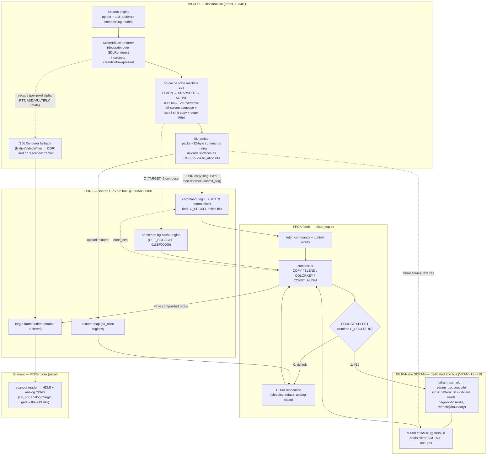

# Frame data flow (post-#19 SDRAM second-bus)

How a frame is generated end-to-end, reflecting the current architecture and
assuming the #19 PSX-pattern SDRAM second-bus controller lands.

> **Issue map:** the SDRAM controller is **#19** (`issue19-psx-sdram-controller`).
> **#26** is the LuaJIT-baseline + profiling work that *diagnosed* motion as
> fabric-bound (fabric ~30–40 ms vs A9 ~8–12 ms while scrolling) and motivated #19.
> Related levers in the diagram: #21 (off-screen bg-cache flatten), #14 (DDR
> texture allocator `blt_alloc`).

## Component + dataflow view



## Per-frame sequence

```mermaid
sequenceDiagram
    autonumber
    participant ENG as Solarus engine
    participant R as MisterBlitterRenderer
    participant EM as blt_emitter
    participant DDR as DDR3 (ring/ctrl/fb)
    participant FAB as blitter_top
    participant SRC as Source (DDR3 readcache ▸ or ▸ SDRAM #19)
    participant OUT as Scanout (HDMI/analog)

    ENG->>R: clear(screen) → begin frame
    loop each draw/fill (tens–hundreds)
        R->>R: bg-cache: cacheable? skip / copy-shift / edge-strip
        R->>EM: emit ~32B blit command
    end
    Note over R,EM: per-pixel-alpha / RTT / ADD → mark frame "escaped"
    ENG->>R: present(window)
    alt frame escaped or emitter overflow
        R->>DDR: SDL software composite → framebuffer (fallback)
    else accelerated
        EM->>DDR: copy ring + control block
        EM->>DDR: store submit_seq (doorbell, last)
        FAB->>DDR: fetch commands + C_SRCSEL
        loop each command
            FAB->>SRC: read source line (BL=2×N if SDRAM)
            SRC-->>FAB: pixels
            FAB->>DDR: composite → target framebuffer
        end
        FAB->>DDR: store done_seq
    end
    DDR->>OUT: scanout target framebuffer → display
    Note over OUT: double-buffer swap; analog vsync must stay roll-free
```

## What #19 changes vs. the original design

Blitter **source** reads — the dominant fabric cost during scrolling — move off
the contended DDR3 f2h bus onto the dedicated SDRAM module via the runtime
`C_SRCSEL` mux. DDR3 still carries the command ring, control block, bg-cache, and
target framebuffers; the DDR3 readcache stays the analog-clean default that one
register write falls back to. The remaining gate is purely on-device: the analog
YPbPr path staying roll-free with SDRAM active.

## References

- `docs/blitter-renderer-integration.md` — the host-side renderer binding.
- `docs/superpowers/specs/2026-06-15-issue19-psx-sdram-controller-design.md` — #19 design.
- `docs/superpowers/specs/2026-06-14-issue21-offscreen-flatten-design.md` — #21 bg-cache.
- `docs/superpowers/specs/2026-06-15-ddr-texture-allocator-design.md` — #14 `blt_alloc`.
