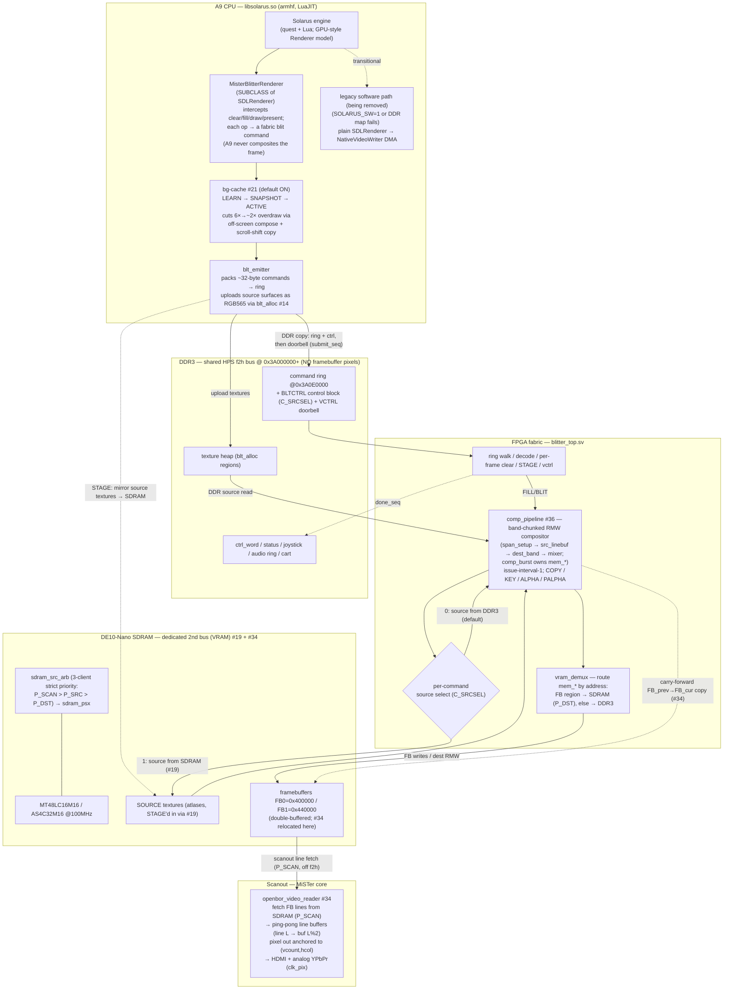

# Frame data flow (FPGA-accelerated compositor + SDRAM VRAM)

How a frame is generated end-to-end, reflecting the **current** architecture:
the A9 emits blit commands, the FPGA fabric composites the frame into an **SDRAM**
framebuffer, and a dedicated scanout reader streams that framebuffer to video. The
original pure-software path is a **transitional bring-up crutch that is being
removed** — not a maintained dual mode.

> **Render path selection (engine):** `games/Solarus/solarus_run.sh` exports
> `SOLARUS_BLITTER=1` (+ `SOLARUS_BGCACHE=1`) by default, so the **fabric offload
> is the path**. `SOLARUS_SW=1` still forces the legacy software path (plain
> `SDLRenderer` → `NativeVideoWriter` full-frame DMA to DDR), and the engine falls
> back to it automatically if the DDR map fails — but that path is on its way out as
> the fabric compositor reaches hardware.
>
> **Issue map:** #19 = SDRAM second-bus source controller (`sdram_psx`); #34 = VRAM
> relocation (framebuffers → SDRAM) + line-buffered scanout; #36 = the pipelined
> compositor (`comp_pipeline`) supersedes the legacy per-pixel blitter FSM.
> Related: #21 (bg-cache overdraw flatten), #14 (DDR texture allocator `blt_alloc`),
> #26 (LuaJIT baseline + the profiling that diagnosed motion as fabric-bound).
>
> **RTL maturity note:** `comp_pipeline` is sim-proven (bit-exact to the retired
> legacy FSM) but its DE10-Nano bring-up is in progress; the legacy renderer is
> recoverable from git history if a HW regression forces a temporary revert.

## Component + dataflow view



> **#34 VRAM relocation:** the target framebuffers moved from DDR3 to the dedicated
> SDRAM bus. The blitter's dest writes are redirected by an integration-layer
> address demux (`vram_demux`); the scanout reader fetches lines from SDRAM via the
> arbiter's strict-priority `P_SCAN` port — so **no framebuffer pixels cross the
> HPS-shared f2h bus**, and the scanout deadline is served by a deterministic bus.
> The persistence carry-forward is a fabric FB→FB blit (the ARM can't write SDRAM).

> **#36 compositor supersede:** `comp_pipeline` is now the **sole** render datapath
> inside `blitter_top`. The legacy per-pixel FSM (`S_BLIT_*`, per-pixel src/dst
> caches, the `C_PIPE` runtime select) is deleted; `blitter_top`'s FSM narrows to
> ring walk + per-frame clear + atlas STAGE + vctrl, handing every FILL/BLIT to
> `comp_pipeline`. The `C_PIPE` control bit is a documented no-op.

## Per-frame sequence

```mermaid
sequenceDiagram
    autonumber
    participant ENG as Solarus engine
    participant R as MisterBlitterRenderer
    participant EM as blt_emitter
    participant DDR as DDR3 (ring/ctrl/doorbell)
    participant FAB as blitter_top + comp_pipeline
    participant SRC as Source (SDRAM staged ▸ or ▸ DDR3 un-staged)
    participant VRAM as SDRAM FB0/FB1 (via vram_demux)
    participant OUT as Scanout (HDMI/analog)

    ENG->>R: clear(target) → begin frame
    loop each draw/fill (tens–hundreds)
        R->>R: bg-cache: cacheable? skip / copy-shift / edge-strip
        R->>EM: emit ~32B blit command (no A9 pixel work)
    end
    ENG->>R: present(window)
    opt non-clear frame (persistence)
        EM->>EM: emit fabric carry-forward FB_prev→FB_cur copy (#34)
    end
    EM->>DDR: copy ring + control block
    EM->>DDR: store submit_seq (doorbell, last)
    FAB->>DDR: fetch commands + control words (C_SRCSEL)
    loop each FILL/BLIT command
        FAB->>SRC: read source span (DDR3, or SDRAM when C_SRCSEL=1)
        SRC-->>FAB: pixels → comp_pipeline band-RMW (issue-interval-1)
        FAB->>VRAM: composite → FB (vram_demux: FB region → SDRAM, off f2h)
    end
    FAB->>DDR: store done_seq; flip active_buffer in ctrl_word
    VRAM->>OUT: scanout line fetch from SDRAM (P_SCAN) → display
    OUT-->>ENG: vsync_count @0x3A070000 (paces next frame; anti-tearing)
    Note over OUT: double-buffer swap on a deterministic SDRAM bus → no f2h-contention roll
```

## What #19 + #34 + #36 change vs. the original design

The original MiSTer path was **pure software**: the A9 composited the whole frame
into a CPU `SDL_Surface` and `present()` DMA'd it to a DDR framebuffer that the
scanout read back over the f2h bus. The current design replaces every stage of that
pixel path with fabric + SDRAM:

**#19** moved blitter **source** reads — the dominant fabric cost during scrolling —
off the contended DDR3 f2h bus onto the dedicated SDRAM module (per-command
`C_SRCSEL`/`F_SRC_SDRAM`).

**#34** completes the VRAM model: the **target framebuffers** also move to SDRAM and
the **scanout reads them from SDRAM**. The blitter's dest writes are redirected by an
address demux (`vram_demux`: FB region → SDRAM, else → DDR3); the reader is dual-bus
(line fetch on the SDRAM `P_SCAN` master; control/joy/vsync/audio/cart still on DDR3).
f2h now carries **no framebuffer pixels** — only the command ring, control/doorbell,
and texture uploads — so the scanout deadline is served by a dedicated, HPS-free,
deterministic bus rather than mitigated against contention. The ARM-side persistence
carry-forward `memcpy` becomes a fabric FB→FB blit (SDRAM is not HPS-addressable).

**#36** replaces the legacy per-pixel blitter FSM with `comp_pipeline`, a
band-chunked read-modify-write compositor that issues one pixel/clock through a
LAT-3 blend pipeline (`comp_mixer`), fed by an on-chip source line buffer and a
320px×16-row destination band buffer, with `comp_burst` sequencing the aligned
bursts on the shared `mem_*` master. This is the throughput lever (the legacy FSM
was ~7–10 cyc/px); it is sim-proven bit-exact to the legacy path, HW bring-up in
progress.

## Scanout read path (#34 — line-buffered)

The scanout reader (`fpga/rtl/openbor_video_reader.sv`) is **position-addressed**,
not occupancy-coupled. The old design bursted a whole frame through one dual-clock
FIFO and emitted pixels by FIFO occupancy, so any f2h underflow shifted every later
pixel → a cumulative vertical scroll on the (write-heavy) SDRAM-source path. The
current design uses two **ping-pong line buffers** (BRAM, 80×64-bit each): line L
always lives in buffer `L%2`. The read side outputs `linebuf[{vcount[0], hcol[8:2]}]`
— anchored to the live display position (`hcol` resets every `new_line`) — while the
fill FSM fetches the next line into the opposite-parity buffer, re-anchored to the
scan (`display_line = vcount+1`, via a gray-coded `vcount` CDC into `ddr_clk`). The
line is read from SDRAM as single-beat qword reads re-issued per qword in
`ST_WAIT_LINE` (the arbiter grants one beat per request). An underflow therefore
degrades to at most a stale line that re-syncs within ~1–2 lines, never a drift.
Orthogonal paths (control word, buffer select, VSYNC writeback, joystick, audio,
cart) are unchanged. Spec:
`docs/superpowers/specs/2026-06-17-line-buffered-scanout-design.md`.

## Datapath module map (as wired in `fpga/Solarus.sv`)

| Boundary | Bus | Notes |
|---|---|---|
| A9 → fabric | DDR3 ring @`0x3A0E0000` + VCTRL doorbell | `blt_emitter` ~32B FILL/BLIT/STAGE/END commands |
| `blitter_top` → `comp_pipeline` | command regs + `blit_start`/`blit_done` | one blit at a time; `C_PIPE` = no-op |
| `comp_pipeline`/`blitter_top` → `vram_demux` | `mem_*` (32-bit qword addr, `burstcnt`, `be`) | `mem_* = pipe_busy ? p_* : bm_*` |
| `vram_demux` → `ddr_blitter_arb` | `bd_*` (DDR side) | non-FB traffic; arb priority **reader > blitter** |
| `vram_demux` → `sdram_src_arb` (`P_DST`) | `sd_*` | FB read/RMW/write; multi-beat read FSM |
| `blitter_top` → `sdram_src_arb` (`P_SRC`) | `src_sdram_*` | source atlas reads; only when `C_SRCSEL=1` |
| `openbor_video_reader` → `sdram_src_arb` (`P_SCAN`) | `rdr_sdram_*` | line fetch; **top priority** |
| `sdram_src_arb` → `sdram_psx` | `c_*`, owner-gated `c_dout64`/`c_dready` | `BURST_BEATS=1`; owner held to its beat (#34) |
| `openbor_video_reader` → A9 | `0x3A070000` `vsync_count` | frame pacing / anti-tearing |

## References

- `docs/blitter-renderer-integration.md` — the host-side renderer binding.
- `docs/superpowers/specs/2026-06-17-pipelined-compositor-design.md` — `comp_pipeline` (#36).
- `docs/superpowers/specs/2026-06-20-supersede-legacy-renderer-design.md` — legacy retire (#36).
- `docs/superpowers/specs/2026-06-17-vram-framebuffer-relocation-design.md` — VRAM → SDRAM (#34).
- `docs/superpowers/specs/2026-06-17-line-buffered-scanout-design.md` — scanout reader (#34).
- `docs/superpowers/specs/2026-06-15-issue19-psx-sdram-controller-design.md` — `sdram_psx` (#19).
- `docs/superpowers/specs/2026-06-14-issue21-offscreen-flatten-design.md` — bg-cache (#21).
- `docs/superpowers/specs/2026-06-15-ddr-texture-allocator-design.md` — `blt_alloc` (#14).
