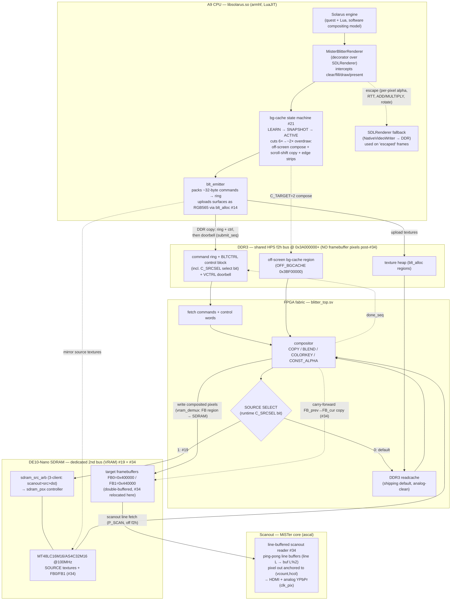

# Frame data flow (post-#19 SDRAM second-bus)

How a frame is generated end-to-end, reflecting the current architecture and
assuming the #19 PSX-pattern SDRAM second-bus controller lands.

> **Issue map:** the SDRAM controller is **#19** (`issue19-psx-sdram-controller`).
> **#26** is the LuaJIT-baseline + profiling work that *diagnosed* motion as
> fabric-bound (fabric ~30–40 ms vs A9 ~8–12 ms while scrolling) and motivated #19.
> Related levers in the diagram: #21 (off-screen bg-cache flatten), #14 (DDR
> texture allocator `blt_alloc`).

## Component + dataflow view



> **#34 VRAM relocation (this branch):** the target framebuffers moved from DDR3 to the
> dedicated SDRAM bus. The blitter's dest writes are redirected by an integration-layer
> address demux (`vram_demux`); the scanout reader fetches lines from SDRAM via the
> arbiter's strict-priority `P_SCAN` port — so **no framebuffer pixels cross the
> HPS-shared f2h bus**, and the scanout deadline is served by a deterministic bus. The
> persistence carry-forward is now a fabric FB→FB blit (the ARM can't write SDRAM). The
> SDL software-composite escape path is dead (removed): the blitter has full op coverage.

## Per-frame sequence

```mermaid
sequenceDiagram
    autonumber
    participant ENG as Solarus engine
    participant R as MisterBlitterRenderer
    participant EM as blt_emitter
    participant DDR as DDR3 (ring/ctrl/doorbell)
    participant FAB as blitter_top
    participant SRC as Source (SDRAM staged ▸ or ▸ DDR3 un-staged)
    participant VRAM as SDRAM FB0/FB1
    participant OUT as Scanout (HDMI/analog)

    ENG->>R: clear(screen) → begin frame
    loop each draw/fill (tens–hundreds)
        R->>R: bg-cache: cacheable? skip / copy-shift / edge-strip
        R->>EM: emit ~32B blit command
    end
    ENG->>R: present(window)
    opt non-clear frame (persistence)
        EM->>EM: emit fabric carry-forward FB_prev→FB_cur copy (#34)
    end
    EM->>DDR: copy ring + control block
    EM->>DDR: store submit_seq (doorbell, last)
    FAB->>DDR: fetch commands + C_SRCSEL
    loop each command
        FAB->>SRC: read source line (per-command F_SRC_SDRAM)
        SRC-->>FAB: pixels
        FAB->>VRAM: composite → FB (via vram_demux, off f2h)
    end
    FAB->>DDR: store done_seq
    VRAM->>OUT: scanout line fetch from SDRAM (P_SCAN) → display
    Note over OUT: double-buffer swap; deterministic SDRAM bus → no f2h-contention roll
```

## What #19 + #34 change vs. the original design

**#19** moved blitter **source** reads — the dominant fabric cost during scrolling — off
the contended DDR3 f2h bus onto the dedicated SDRAM module (per-command `F_SRC_SDRAM`).

**#34 (this branch)** completes the VRAM model: the **target framebuffers** also move to
SDRAM, and the **scanout reads them from SDRAM**. The blitter's dest writes are redirected
by an integration-layer address demux (`vram_demux`, FB region → SDRAM, else → DDR3); the
reader becomes dual-bus (line fetch on the SDRAM `P_SCAN` master, control/joy/vsync/audio/
cart still on DDR3). f2h now carries **no framebuffer pixels** — only the command ring,
control/doorbell, and texture uploads — so the scanout deadline is served by a dedicated,
HPS-free, deterministic bus rather than mitigated against contention. The ARM-side
persistence carry-forward `memcpy` becomes a fabric FB→FB blit (SDRAM is not
HPS-addressable). The DDR3-framebuffer scanout path and the SDL escape fallback are
removed (full commit; blitter has full op coverage). Remaining gate: on-device HW
validation that the SDRAM scanout is stable and analog-clean (Task 7).

## Scanout read path (#34 — line-buffered)

The scanout reader (`fpga/rtl/openbor_video_reader.sv`) is **position-addressed**,
not occupancy-coupled. The old design bursted a whole frame through one dual-clock
FIFO and emitted pixels by FIFO occupancy, so any f2h underflow shifted every later
pixel → a cumulative vertical scroll on the (write-heavy) SDRAM-source path. The
current design uses two **ping-pong line buffers** (BRAM, 80×64-bit each): line L
always lives in buffer `L%2`. The read side outputs `linebuf[{vcount[0], hcol[8:2]}]`
— anchored to the live display position (`hcol` resets every `new_line`) — while the
fill FSM fetches the next line into the opposite-parity buffer, re-anchored to the
scan (`display_line = vcount+1`, via a gray-coded `vcount` CDC into `ddr_clk`). An
underflow therefore degrades to at most a stale line that re-syncs within ~1–2 lines,
never a drift. Orthogonal paths (control word, buffer select, VSYNC writeback,
joystick, audio, cart) are unchanged. Spec:
`docs/superpowers/specs/2026-06-17-line-buffered-scanout-design.md`.

## References

- `docs/blitter-renderer-integration.md` — the host-side renderer binding.
- `docs/superpowers/specs/2026-06-15-issue19-psx-sdram-controller-design.md` — #19 design.
- `docs/superpowers/specs/2026-06-14-issue21-offscreen-flatten-design.md` — #21 bg-cache.
- `docs/superpowers/specs/2026-06-15-ddr-texture-allocator-design.md` — #14 `blt_alloc`.
